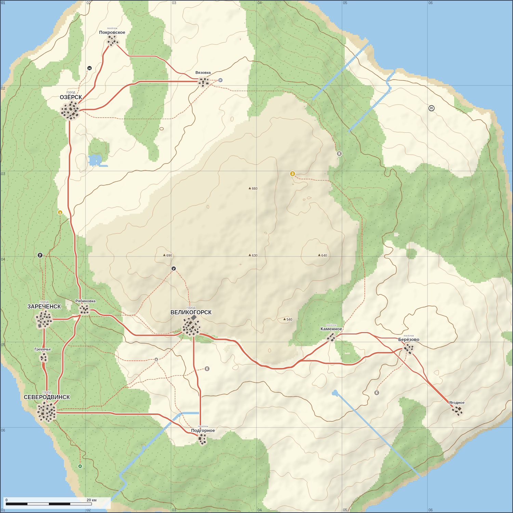

# 🗺️ Топокарта — генератор местности

Программа для создания **топографических карт местности** для военно-ролевых
игр — в духе карт из игры ARMA (просто карта местности, без игрового движка).

Проект сделан как учебный: цель — разобраться, как программирование работает
с помощью ИИ. Поэтому весь код подробно прокомментирован на русском языке.



## Что умеет (этап 1: генератор)

- **Процедурная генерация местности** по «сиду» (зерну): один и тот же сид
  всегда даёт одну и ту же карту, разные сиды — разные карты.
- **Высокое разрешение и рельефная тень**: местность отрисовывается с плавным
  затенением склонов (hillshade) — карта выглядит объёмной и реалистичной.
- **Реальный масштаб мира (км)**: задаётся сторона региона в километрах, а
  размеры населённых пунктов — в реальных километрах. Поэтому на крупном
  регионе (область) города выглядят пропорционально мелкими — как город ВНУТРИ
  региона, — а на маленьком регионе видна детальная застройка. На карте —
  координатная сетка в км и **масштабная линейка**.
- **Объекты местности**: вода (озёра, море), побережье, поля, **леса с
  текстурой** (точки-«деревья», как на топокартах), возвышенности и **реки**
  (русла прокладываются вниз по склону).
- **Горизонтали (изолинии высот)** — линии равной высоты, главный признак
  топографической карты. Строятся алгоритмом «марширующих квадратов».
- **Отметки высот** на заметных вершинах (треугольник и высота в метрах над
  уровнем моря) — ещё один классический элемент топокарты.
- **Разные виды населённых пунктов — от деревни до мегаполиса.** Размер,
  плотность, число улиц и стиль названия зависят от вида. Это по-прежнему не
  точки, а настоящая застройка: сначала строится **связная уличная сеть**
  (главные улицы + связующие переулки между ними, а у городов — ещё квартальная
  сетка и кольцевая дорога). Все улицы соединены и через центр выходят на
  въездные трассы — то есть это реальные дороги, ведущие куда-то, а не
  декорация. Затем вдоль улиц расставляются дома (гарантированно **не
  наслаиваясь** друг на друга) с разрывами и разной плотностью — гуще в центре,
  реже к окраине. У посёлков и городов —
  **центральная площадь**. Есть зонирование: центр (гражданские здания), жилая
  застройка и промзона на окраине. Названия — реальные русские топонимы
  (Берёзовка, Озёрск, Горнозаводск…).
- **Дороги по рельефу.** Трассы прокладываются поиском пути (A*) с учётом
  крутизны склонов и воды: дороги вьются по пологому, обходят горы и озёра, а
  узкие реки и протоки пересекают **мостами**. Класс дороги (магистраль /
  дорога / местная) зависит от размера соединяемых пунктов, а главные улицы
  городов стыкуются с входящими трассами.
- **Поэтапная генерация и «скрытая экономика».** Карта рождается во времени:
  сперва ландшафт и **точки ресурсов** (нефть/лес/золото/руда/уголь/камень),
  затем небольшие пункты тик за тиком (условный «год») **развиваются**:
  тянут дороги к ресурсам и строят **шахты**, соединяются дорогами и **торгуют**
  (делятся доступом к ресурсам по сети), при доступе к руде+углю или нефти
  **индустриализируются**. «Вид» пункта (деревня…мегаполис) не задан заранее —
  он **вырастает из населения**: кто удачно встал и развил экономику, тот и стал
  городом. Развитие можно **проиграть как анимацию** (кнопка ▶), перемотать
  ползунком «годы» или сразу прыгнуть к финалу (⏭).
- **Сетка координат** с подписями по краям — как на военных картах.
- Настройки: масштаб региона (км), разрешение, уровень воды, лесистость, число
  населённых пунктов и **точек ресурсов**; проигрыватель развития (годы,
  скорость); галочки сетки, горизонталей, рельефной тени и подписей.
- **Экспорт готовой карты в PNG** — можно распечатать или отправить игрокам.

## Как запустить

Никакой установки не требуется — это обычная веб-страница.

**Способ 1 (самый простой):** открыть файл `index.html` двойным щелчком в
браузере (Chrome, Firefox, Edge).

**Способ 2 (через локальный сервер):** если хочется «по-взрослому»,
из папки проекта выполнить любую из команд и открыть `http://localhost:8000`:

```bash
# если установлен Python
python3 -m http.server 8000

# или если установлен Node.js
npx serve
```

## Как этим пользоваться

1. Нажми **«Сгенерировать карту»** или 🎲 рядом с полем сида, чтобы получить
   новую местность.
2. Покрути ползунки: **масштаб региона (км)**, **уровень воды**, **лесистость**,
   **число населённых пунктов**, **разрешение (детализация)** — карта
   перестроится. Чем больше масштаб региона, тем мельче города на фоне карты.
3. Галочки справа включают/выключают сетку, горизонтали, рельефную тень и
   подписи пунктов.
4. Кнопка **«Сохранить в PNG»** выгрузит картинку карты на диск.

> 💡 Запомни понравившийся **сид** — по нему всегда можно воссоздать ту же карту.

## Как устроен код

Проект намеренно разбит на маленькие файлы с одной задачей у каждого —
так проще читать и развивать:

| Файл | За что отвечает |
|------|-----------------|
| `index.html` | Разметка страницы: холст карты и панель управления |
| `css/style.css` | Внешний вид (тёмная тема, расположение элементов) |
| `js/noise.js` | «Шум» — основа естественного рельефа (плавные холмы) |
| `js/generator.js` | Строит **модель** карты: высоты, уклоны, типы поверхности, реки, виды пунктов, дороги по рельефу (A*) |
| `js/town.js` | Детальная **застройка пункта**: улицы, кварталы, дома — с учётом вида (деревня…мегаполис) и рельефа |
| `js/simulation.js` | **Экономика и развитие** во времени: ресурсы, шахты, дороги, торговля, индустриализация, рост пунктов (история по «годам») |
| `js/renderer.js` | **Рисует** модель на холсте в топографическом стиле (с рельефной тенью) |
| `js/main.js` | Связывает интерфейс с генератором и отрисовкой |

Главная идея архитектуры: **«данные отдельно, картинка отдельно»**.
`generator.js` ничего не рисует — он только считает, что где находится.
`renderer.js` ничего не генерирует — он только рисует готовую модель.
Благодаря этому одну и ту же карту можно нарисовать по-разному, а логику
менять, не трогая отрисовку.

## План разработки

| Этап | Что делаем | Статус |
|------|-----------|--------|
| 1. Генератор | Местность по сиду, объекты (вода, песок, поля, лес, горы), горизонтали, дороги, сетка, экспорт PNG | ✅ Готово |
| — Детальные города | Застройка: контур, улицы, кварталы, дома, зонирование (центр/жильё/промзона), площадь | ✅ Готово |
| — Реализм местности | Высокое разрешение, рельефная тень, реки, виды пунктов (деревня…мегаполис), дороги по рельефу с мостами | ✅ Готово |
| — Экономика и развитие | Точки ресурсов, шахты, торговля, индустриализация; поэтапная генерация с анимацией «по годам»; вид пункта вырастает из экономики | ✅ Готово (ядро) |
| — Качество застройки | Прямоугольные кварталы, парки/скверы, более чёткое зонирование и урбанизация | ⏳ Следующий |
| 2. Редактор | Кисти для рисования местности мышью, размер кисти, отмена/повтор, сохранение/загрузка проекта `.json` | ⏳ |
| 3. Объекты и подписи | Ручная расстановка/переименование городов и объектов, отметки высот | ⏳ |
| 4. Тактический слой | Военные знаки (позиции, стрелки, рубежи, цели), линейка расстояний и азимутов | ⏳ |
| 5. Оформление и печать | Легенда, масштабная линейка, стрелка севера, экспорт в PDF | ⏳ |

### Известные ограничения текущей версии

- Пока генерируется только «островной» тип местности. Позже добавим
  материковые и прибрежные карты.
- Реки прокладываются «стеканием» вниз по склону и изредка заканчиваются во
  внутренней впадине (бессточно), а не впадают в море.

## Технологии

Чистый **HTML + CSS + JavaScript** без сторонних библиотек и сборки.
Графика рисуется на элементе `<canvas>`. Выбор сделан ради простоты обучения:
один язык, мгновенный результат, ничего не нужно устанавливать.
